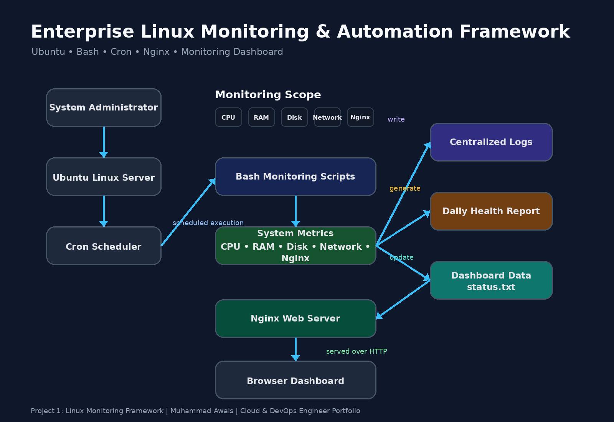
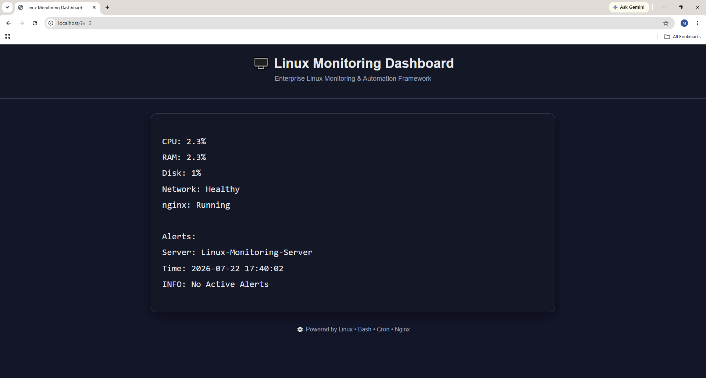
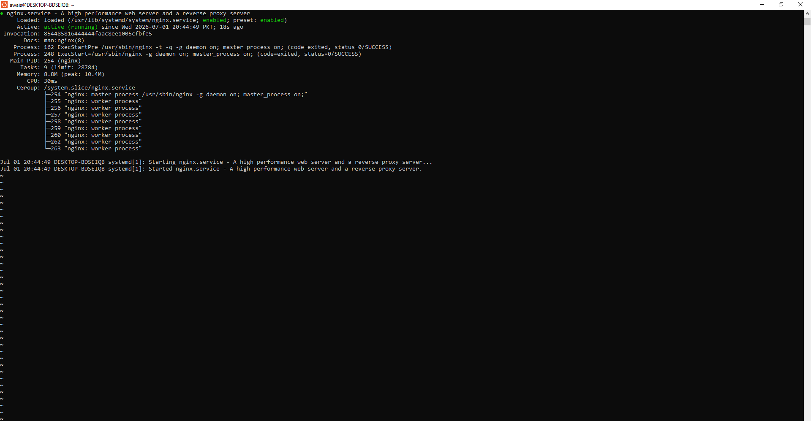
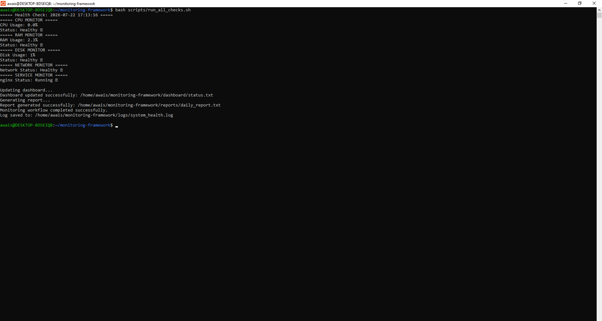
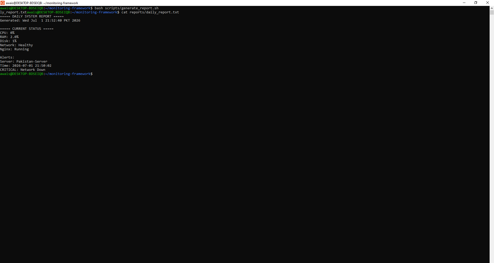
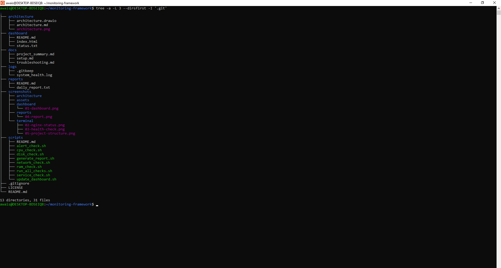

# 🚀 Enterprise Linux Monitoring & Automation Framework

> A production-inspired Linux monitoring and automation framework built with **Ubuntu**, **Bash**, **Cron**, and **Nginx** to automate system health checks, centralized logging, report generation, and a web-based monitoring dashboard.

---

## 📌 Project Highlights

- 🐧 Ubuntu Linux
- 📜 Bash Scripting
- ⏰ Cron Automation
- 🌐 Nginx Web Server
- 📊 HTML Monitoring Dashboard
- 📄 Automated Report Generation
- 📝 Centralized Logging
- 🚨 Alert Monitoring

---

## 🏗️ Architecture  Diagram




**Figure 0:** Enterprise Linux Monitoring & Automation Framework architecture showing the complete workflow from system administration and monitoring scripts to logging, reporting, dashboard generation, Nginx, and browser access.

---


## 📷 Dashboard Preview



**Figure 1:** Live Linux Monitoring Dashboard displaying CPU, RAM, Disk, Network, Nginx status, alerts, and server health.

---
## 📷 Nginx Service Status



**Figure 2:** Nginx service running successfully on Ubuntu Linux. The monitoring framework continuously verifies that the Nginx web server is active and available.

---
## 📷 Health Check Execution



**Figure 3:** The monitoring framework executes all health check scripts in a single run, validating CPU, RAM, Disk, Network, and Nginx service status before updating logs, reports, and the monitoring dashboard.

---
## 📷 Daily Health Report



**Figure 4:** The monitoring framework automatically generates a daily system report containing CPU, RAM, Disk, Network, Nginx status, timestamps, and active alerts for operational visibility and troubleshooting.

---

## 📷 Project Structure



**Figure 5:** Organized project structure showing separation of scripts, dashboard, documentation, reports, architecture, and screenshots following engineering best practices.

## 📚 Documentation

- 📐 [Architecture Overview](architecture/architecture.md)
- ⚙️ [Setup Guide](docs/setup.md)
- 🛠️ [Troubleshooting Guide](docs/troubleshooting.md)
- 📊 [Dashboard Documentation](dashboard/README.md)
- 📄 [Reports Documentation](reports/README.md)
- 🖥️ [Scripts Documentation](scripts/README.md)

---


## 🎯 Business Problem

Managing Linux servers manually is time-consuming and error-prone. This project automates system health monitoring, service validation, report generation, and dashboard updates to reduce operational effort and improve visibility across Linux environments.

---

## 🎯 Project Goals

- Automate Linux system monitoring
- Detect service failures automatically
- Generate health reports
- Centralize monitoring logs
- Display server health through a web dashboard


---## 🛠️ Technology Stack

<p align="left">


</p>


---

## 📂 Project Structure

```text
linux-monitoring-framework/
│
├── architecture/
├── dashboard/
├── docs/
├── reports/
├── screenshots/
├── scripts/
├── config/
├── logs/
├── LICENSE
├── .gitignore
└── README.md
```

---

## ✨ Features

- ✅ CPU Monitoring
- ✅ RAM Monitoring
- ✅ Disk Usage Monitoring
- ✅ Network Connectivity Checks
- ✅ Nginx Service Monitoring
- ✅ Automated Health Reports
- ✅ Centralized System Logs
- ✅ HTML Dashboard
- ✅ Cron-based Automation
- ✅ Alert Detection
- ✅ Bash Automation Scripts

---

## ⚙️ Installation

### Prerequisites

- Ubuntu 24.04+ (or WSL Ubuntu)
- Git
- Bash
- Nginx

### Clone Repository

```bash
git clone https://github.com/awais-clouddev/linux-monitoring-framework.git
cd linux-monitoring-framework
```

### Make Scripts Executable

```bash
chmod +x scripts/*.sh
```

### Run the Monitoring Framework

```bash
bash scripts/run_all_checks.sh
```


## ▶️ Usage

### Run All Monitoring Checks

```bash
bash scripts/run_all_checks.sh
```

### Generate Daily Health Report

```bash
bash scripts/generate_report.sh
```

### Open the Dashboard

```bash
cd dashboard
python3 -m http.server 8080
```

Open your browser:

```text
http://localhost:8080
```

### Monitor Nginx Service

```bash
systemctl status nginx
```

---

## 🔄 Automation Workflow

The monitoring framework follows this automated workflow:

1. System administrator executes the monitoring framework.
2. Bash scripts collect CPU, RAM, Disk, Network, and Nginx metrics.
3. System metrics are validated and analyzed.
4. Monitoring logs are generated and stored.
5. Daily health reports are created automatically.
6. Dashboard data is updated.
7. Nginx serves the latest dashboard.
8. Users access the monitoring dashboard through a web browser.

The complete workflow is illustrated in the Architecture Diagram above.

## 🖥️ Live Dashboard

The monitoring dashboard provides a real-time overview of server health through a lightweight HTML interface served by Nginx.

It displays:

- CPU utilization
- RAM usage
- Disk utilization
- Network connectivity
- Nginx service status
- Current alerts
- Server information
- Last monitoring timestamp

The dashboard is automatically refreshed whenever the monitoring framework executes, providing an up-to-date view of the system.

---

## 🚨 Alert System

The monitoring framework automatically detects abnormal system conditions and records alerts for administrators.

Current alert checks include:

- Network connectivity failures
- Nginx service availability
- High resource utilization (future enhancement)

Alerts are displayed on the dashboard and included in the generated health report for quick troubleshooting.

---
## 🌿 Git Version Control

This project follows a professional Git workflow.

Every major milestone—including monitoring scripts, dashboard improvements, documentation, architecture diagrams, and screenshots—is tracked through meaningful Git commits.

The complete development history is available in this repository, providing full traceability of the project's evolution.

---

## 🛠️ Challenges & Solutions

During development, several practical issues were encountered and resolved:

- Resolved Git remote and merge conflicts.
- Fixed Windows `.png.png` filename duplication.
- Corrected file permission issues for Bash scripts.
- Solved dashboard synchronization with Nginx.
- Improved project structure and documentation.
- Standardized Git commits and repository organization.

These challenges provided valuable hands-on troubleshooting experience similar to real engineering environments.

---

## 📚 Lessons Learned

This project strengthened practical skills in:

- Linux system administration
- Bash scripting
- Process automation
- Nginx configuration
- Git and GitHub workflows
- Technical documentation
- Troubleshooting and debugging
- Building production-style project structures

The project also reinforced the importance of automation, maintainability, and clear documentation in DevOps engineering.

---

## 🚀 Future Improvements

Planned enhancements for future versions include:

- Multi-server monitoring
- Email and Slack alert notifications
- Docker container monitoring
- AWS cloud deployment
- Grafana and Prometheus integration
- CI/CD pipeline automation
- Kubernetes deployment
- Historical metrics visualization

These improvements will gradually transform the project into a production-ready monitoring platform.

---

## 👨‍💻 Author

**Muhammad Awais**

Cloud & DevOps Engineer Portfolio

- GitHub: https://github.com/awais-clouddev
- Project: Enterprise Linux Monitoring & Automation Framework

---

⭐ If you found this project useful, consider giving it a star.


